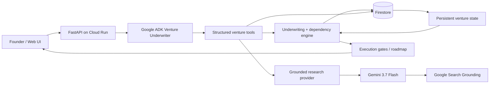

# Venture Twin Agent

A persistent venture-building agent for the **Google All Things Agentic Hackathon — Collaborative Partner track**.

> **Before you put money into a business, do the homework. Then keep doing it as reality changes.**

Venture Twin turns an idea into a structured, evidence-backed venture state rather than a one-off business-plan document. It asks for the founder's real constraints, decomposes the business into assumptions, searches for evidence that can kill those assumptions, models the economics, blocks irreversible steps while critical facts are weak, and turns surviving ventures into an execution roadmap covering registration, tax, licensing, suppliers, service providers and launch dependencies.

The same venture state persists after the first decision. If rent changes, a competitor appears, a supplier quote arrives, or operating data replaces an estimate, the agent mutates the relevant assumption and re-runs the downstream model.

## What is implemented

- Structured founder intake: capital, protected reserve, income target, location, loss tolerance, launch horizon, time commitment and experience.
- Persistent **assumption ledger** with confidence, impact weight and evidence provenance.
- Adversarial research interface with two modes:
  - `offline`: deterministic demo fixtures clearly labelled as non-factual demo data.
  - `live`: Gemini 3.7 Flash with Google Search grounding for current market, competitor, regulatory and execution research.
- Reproducible Monte Carlo cash/runway stress test. It reports the probability of satisfying the explicit modeled conditions, **not a fake universal "business success probability"**.
- Decision engine: `needs_data`, `reject`, `conditional`, `approve`.
- Capital-commitment gates that remain locked while critical assumptions are weak.
- Execution roadmap with official-source requirements for registration/tax/licensing research.
- Material-change events that mutate assumptions and re-underwrite the venture.
- Decision history: the system remembers why a prior configuration was approved, conditional or rejected.
- Google ADK agent with tools that read and mutate the structured venture twin.
- FastAPI web/API surface and a responsive hackathon demo UI.
- SQLite local persistence and Firestore cloud persistence.
- Cloud Run-ready Dockerfile.
- Automated tests and GitHub Actions CI.

## Canonical demo

Founder input:

- Business: neighbourhood supermarket/minimart
- Location: Ruiru, Kiambu County, Kenya
- Available capital: KES 1.8m
- Protected reserve: KES 150k
- Desired owner income: KES 120k/month
- Maximum acceptable loss: KES 600k

The local demo deliberately treats `transactions_per_day` as a weak critical assumption. The result should therefore stay conditional/rejected rather than quietly promoting an invented footfall number into truth. The location/lease gate remains locked until the critical uncertainty is resolved.

## Architecture



Local development swaps Firestore for SQLite and can swap live research for deterministic fixtures. The domain model and decision engine stay identical.

## Why this is agentic

The product is intentionally not a chat wrapper. The ADK agent has tools that mutate durable venture state:

- `create_venture`
- `inspect_venture`
- `run_underwriting`
- `add_founder_evidence`
- `apply_material_change`
- `complete_execution_step`

The system can be invoked asynchronously through analysis jobs. A production deployment can schedule recurring re-research calls (for example with Cloud Scheduler/Pub/Sub) without changing the core state model.

## Local setup

### Prerequisites

- Python 3.11+
- `uv`

### Install

```bash
cp .env.example .env
uv sync --extra dev
```

The default `.env` settings use:

```env
DATABASE_BACKEND=sqlite
RESEARCH_MODE=offline
GEMINI_MODEL=gemini-3.7-flash
```

Start the application:

```bash
uv run uvicorn app.main:app --reload --port 8080
```

Open `http://localhost:8080`.

### Run the ADK agent playground

The repository contains an ADK `app/agent.py` entrypoint and `agents-cli-manifest.yaml`.

```bash
uvx google-agents-cli setup --skip-auth
uvx google-agents-cli playground
```

For live model calls, add a Gemini API key or configure Google Cloud authentication as documented by Google ADK.

## Live grounded research

Set:

```env
RESEARCH_MODE=live
GEMINI_API_KEY=your_key
GEMINI_MODEL=gemini-3.7-flash
```

Then restart the API. Live analysis uses Gemini's Google Search grounding. The prompt explicitly prioritizes evidence against the business case and forbids invented licences, fees, laws, suppliers, providers, prices and URLs.

The live provider also downgrades a claimed source to low confidence when the response exposes grounding metadata and the claimed URL does not match a grounded URL.

## Firestore mode

Create a Google Cloud project, enable Firestore, authenticate locally, then set:

```env
DATABASE_BACKEND=firestore
GOOGLE_CLOUD_PROJECT=your-project-id
FIRESTORE_DATABASE=(default)
```

The Firestore repository stores:

- `ventures/{venture_id}`
- `analysis_jobs/{job_id}`

## Test it

```bash
uv run ruff check app tests
uv run pytest --cov=app --cov-report=term-missing
```

The suite tests the actual deterministic engine, API, persistence and ADK import path. It includes failure-oriented cases: inadequate capital kills the current configuration, weak demand evidence prevents approval, irreversible roadmap steps remain locked, and a changed rent quote recomputes profitability.

## Docker / Cloud Run

Build locally:

```bash
docker build -t venture-twin-agent .
docker run --rm -p 8080:8080 \
  -e RESEARCH_MODE=offline \
  -e DATABASE_BACKEND=sqlite \
  venture-twin-agent
```

Example Cloud Run deployment:

```bash
gcloud run deploy venture-twin-agent \
  --source . \
  --region us-central1 \
  --allow-unauthenticated \
  --set-env-vars DATABASE_BACKEND=firestore,RESEARCH_MODE=live,GEMINI_MODEL=gemini-3.7-flash,GOOGLE_CLOUD_PROJECT=$GOOGLE_CLOUD_PROJECT
```

Store the Gemini key in Secret Manager rather than placing it in source control, then expose it to Cloud Run as `GEMINI_API_KEY`.

## API

| Method | Endpoint | Purpose |
|---|---|---|
| `POST` | `/api/ventures` | Create persistent venture state |
| `GET` | `/api/ventures` | List ventures |
| `GET` | `/api/ventures/{id}` | Read venture twin |
| `POST` | `/api/ventures/{id}/analysis` | Queue background underwriting |
| `POST` | `/api/ventures/{id}/analysis/sync` | Deterministic test/demo underwriting |
| `GET` | `/api/jobs/{id}` | Inspect asynchronous job state |
| `POST` | `/api/ventures/{id}/evidence` | Replace weak assumptions with evidence |
| `POST` | `/api/ventures/{id}/changes` | Apply a material real-world change and re-underwrite |
| `POST` | `/api/ventures/{id}/roadmap/{step}/complete` | Advance an unlocked execution gate |
| `POST` | `/api/demo` | Create canonical Ruiru demo |

## Truthfulness rules

The most important product behaviour is what it refuses to claim.

1. A model estimate is not verified evidence.
2. An illustrative/demo number is never presented as a current Kenyan market fact.
3. Laws, licences, fees and official procedures require official-source research.
4. A Monte Carlo output is described by the assumptions it tests; it is not a universal probability that a company "succeeds".
5. Irreversible legal and financial actions remain explicitly user-approved.
6. Unknowns are allowed to remain unknown. The agent should ask for a real-world validation task rather than manufacture certainty.

## Hackathon fit

**Track: Collaborative Partner.** The agent captures the founder's constraints, persistently mutates a structured venture model, actively challenges the user's thinking and adapts the roadmap as new evidence arrives. The implementation uses Gemini 3.7 Flash, Google ADK, and is Cloud Run/Firestore ready.

## Current boundary

This repository is a functional hackathon MVP, not a licensed legal, accounting or investment-advice service. Live registration/regulatory research is built to surface official sources and execution dependencies; production use would require jurisdiction-specific review, authentication, authorization, audit logging and explicit approval flows around submissions/payments.
