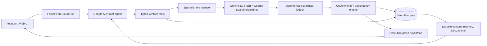

# Architecture notes

## Core design decision
The LLM never owns the source of truth. It reasons over and mutates a typed venture state. This makes changes inspectable and lets deterministic tests validate business logic independently from model variability.

## Production path

### ADK orchestration
`app/agent.py` defines the Google ADK founder-facing agent. Consequential actions go through typed tools: create/inspect ventures, run specialist research, add evidence, apply changes, fork configurations, run sandbox experiments, manage monitor schedules and complete roadmap steps.

The deployed fallback-safe research path uses `SPECIALIST_MODE=orchestrated`: five role-scoped specialist passes are coordinated over the same durable venture state with Gemini + Google Search grounding. The repository also contains `SPECIALIST_MODE=agentic`, where those five roles become separate ADK sub-agents with scoped browser/search tools; that mode additionally requires Tavily credentials.

### Domain + deterministic engine
`app/domain.py` contains the typed venture state. `app/engine.py` performs confidence scoring, uncertainty propagation, Monte Carlo simulation, decisioning and gate transitions. Model output proposes evidence; deterministic code decides what is admissible and what affects the venture.

### Research
`app/research.py` defines the provider boundary. `OfflineResearchProvider` is deterministic and explicitly non-factual. Production uses `GeminiGroundedResearchProvider` with Gemini 3.7 Flash and Google Search grounding plus anti-fabrication/source validation rules.

### Persistence
`app/repository.py` provides SQLite for local/test mode and Neon/Postgres for the Cloud Run deployment. Venture state, jobs, event history, evidence, specialist reports, monitor schedules and ADK conversation sessions survive process restarts and Cloud Run scale-to-zero.

### API/UI
`app/main.py` exposes the HTTP API and `web/` is a no-build static frontend served by the same Cloud Run service.

### Background work
Analysis and specialist work can be dispatched asynchronously and is recorded durably. Cloud Run must allocate CPU outside requests for in-process background work to continue after the initiating response. For a long-lived production scheduler, Cloud Scheduler/Pub/Sub or Cloud Tasks is the stronger design because it does not depend on an idle web instance remaining alive.

## Production extensions
- Cloud Scheduler + Pub/Sub/Cloud Tasks for durable periodic watch sweeps and long-running jobs.
- Secret Manager references for model/API credentials rather than deployment-time environment injection.
- Cloud Logging/Trace plus explicit tool/action audit logs.
- Authenticated per-user venture ownership before exposing real founder data.
- Provider-specific quote requests and application/form preparation with explicit approval boundaries.
